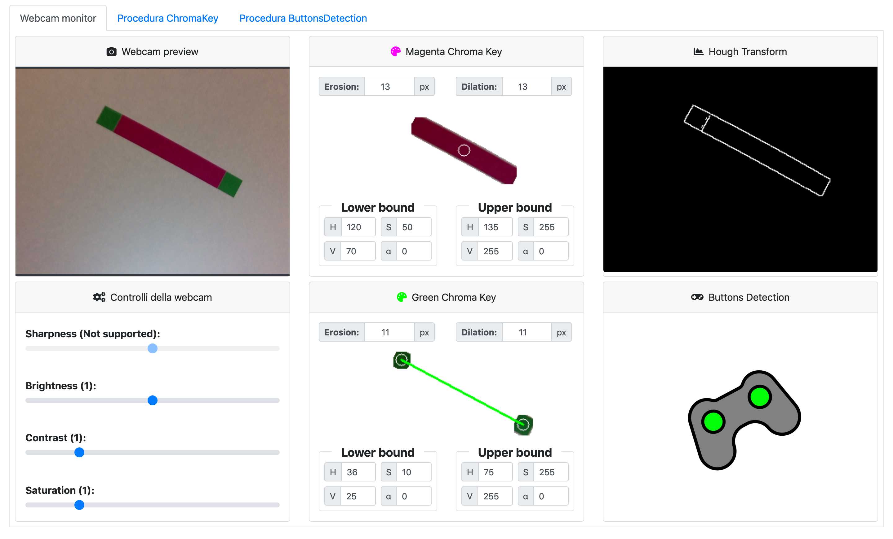
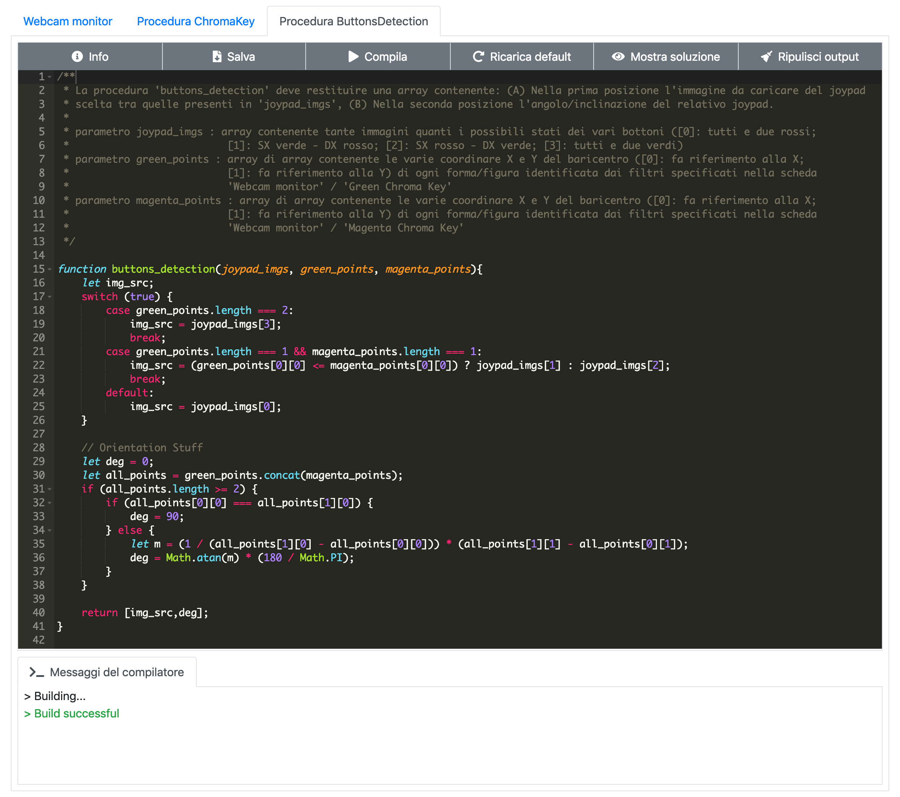

# Introduction
The aim of this project was to develop a *web application* that provides support for teaching some basic *computer vision* techniques. [This web-app](Project/Web-App%20(2019)) comes from the porting of an existing [Java application](Project/Java%20App%20(2017)), which therefore requires to have installed the **JVM** (*Java Virtual Machine*) to be executed, which is why the web app takes over and expands the features previously provided in a context where there are as less as possible constraints required for the user to have it installed in order to use the application.
To respect these characteristics, during the development phase of this project, were used the most modern web technologies to create a  strongly interactive **SPA** (*Single-Page Application*) managed by some simple syntactic checks on the code produced by the students, by taking advantage of the features provided by some dynamic languages like *Javascript*.

To run [this project](Project/Web-App%20(2019)) locally without any errors you should use a local web server (e.g. [200 Ok - Chrome Web Server](https://chrome.google.com/webstore/detail/web-server-for-chrome/ofhbbkphhbklhfoeikjpcbhemlocgigb?hl=en))

# Documentation
If you want to know more about this project you should take a look at the following detailed documentation:
* [Project Documentation (v1.0).pdf](Documentation/Project%20Documentation%20(v1.0).pdf)

**N.B.** The docs are written in Italian.

# Screenshots

  
  
  

# License
The material is available under the [Apache 2.0](https://github.com/FabioDainese/Computer_Vision/blob/master/LICENSE).